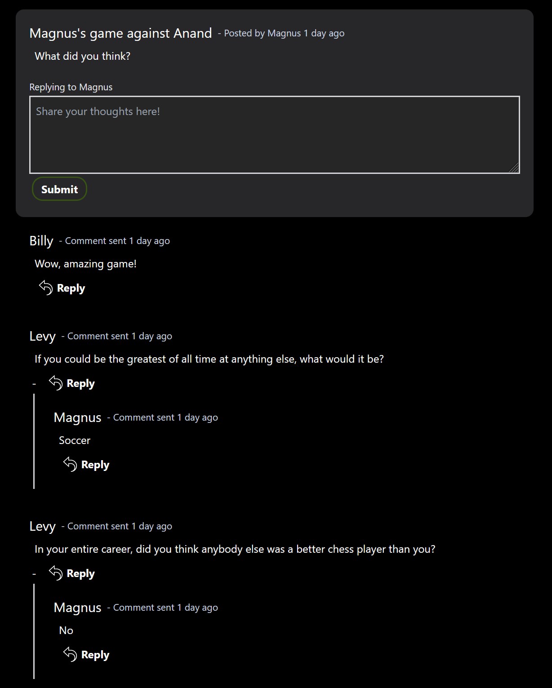
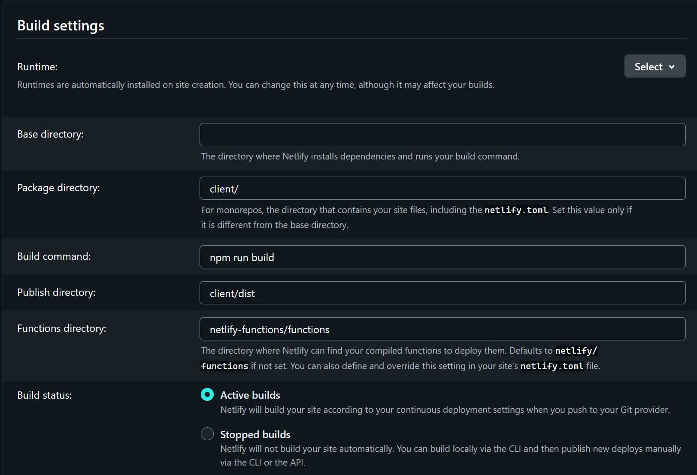
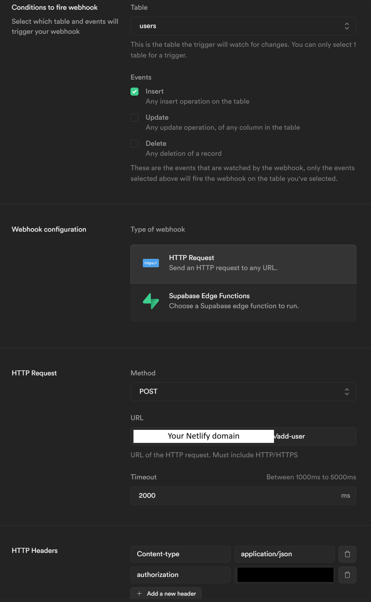
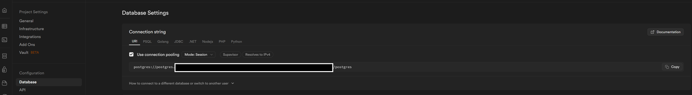
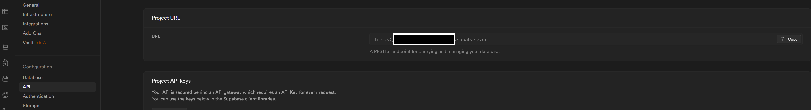
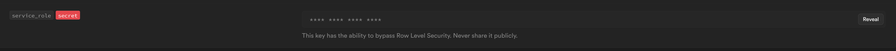

# Hacker news clone

This is a hacker-news-clone using SolidJS for the frontend and a fastify web-server with trpc plugin for the backend. All of the posts and comments are being stored in a Supabase database. I used two Supabase projects for development and production. Supabase services are also being utilized to authenticate users by eamil magiclinks, Google OAuth, and Github OAuth.

Live site: https://nabil-hacker-news-clone.netlify.app/

#### Example

<h2>Project Setup</h2>

For development, you can run both server and client by running <code>npm start</code> at the root of the project

 

To run netlify-functions in development, you will need to install netlify client first: https://docs.netlify.com/cli/get-started/. The server can then be started by running <code>npm start</code> under <code>/netlify-functions</code> folder. To run <code>npm run test-query</code> command, you will need to create a <code>testQueries.ts</code> file directly under <code>/netlify-functions</code> folder. This file can make fetch calls to <code>http://localhost:8888/add-user-dev</code> to test the function.

<h3> Hosting services </h3>

  
<h4>Netlify</h4>

  
  
For front end and netlify functions, we use netlify to host. The application is deployed directly from Github with this build

  
  
<code>add-use</code> is a netlify serverless function which is being called by a webhook from Supabase to automatically generate an username in profile table when an user gets authenticated by Supabase. There are two functions for development and production each.

  
Serverless netlify functions are being utlized because publicly exposed endpoints are needed to allow Supabase to access in dev environment.

  

  
<h4>Auth-Webhook (Supabase)</h4>

  
  
To create a webhook, go to this page in your Supabase project: https://supabase.com/dashboard/project/_/database/hooks. The webhook should look something like this:

  
  
The name of the webhook can be anything. Authorization value in http headers will be randomnly generated characters. Make sure this same value is in netlify project environment variables as <code>AUTHORIZATION_KEY</code>. For development, it will have a separate variable as <code>AUTHORIZATION_KEY_DEV</code>.

   

<h3>Environment variables needed</h3>

  
<h4>ENV for the server folder</h4>

  
  
These values will be different for development and production because there are separate Supabase project databases for each environment.

   
  
<code>NODE_ENV</code> = "development" or "production"

   
  
<code>DATABASE_URL</code> Copy the connection string and pass the password you used to create the database into the connection string.

  
   
   
  
<code>PROJECT_URL</code>

  
   
   
  
<code>SUPABASE_KEY</code> This is in API under settings in Supabase. This is under the same settings as the PROJECT_URL is in.

  

  
<h4>ENV for the netlify-functions folder</h4>

  
<code>SUPABASE_KEY</code> and <code>SUPABASE_KEY_DEV</code> have the same values as in the server ENV for production and development respectively.

   
  
<code>PROJECT_URL</code> and <code>PROJECT_URL_DEV</code> have the same values as in the server ENV for production and development respectively.

   
  
<code>AUTHORIZATION_KEY</code> and <code>AUTHORIZATION_KEY_DEV</code> have the same values as in the server ENV for production and development respectively.

