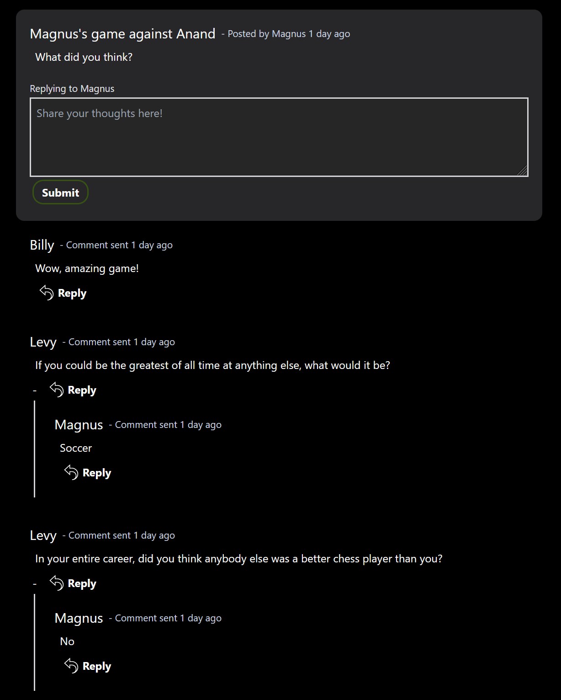
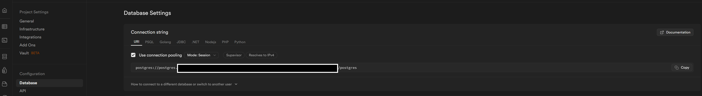
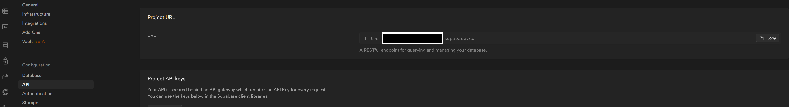
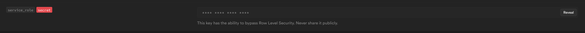

# Hacker news clone

This is a hacker-news-clone using SolidJS front-end and fastify with trpc plugin backend. All of the posts and comments are being stored in Supabase postgres database. Supabase is also being utilized to authenticate users by email magiclinks, Google OAuth, and Github OAuth.

Live site: https://nabil-hacker-news-clone.netlify.app/

#### Example

### Environment variables needed

#### Inside of the server folder.

NODE_ENV = "development" or "production"

DATABASE_URL
Copy the connection string and pass the password you used to create the database into the connection string.

PROJECT_URL

SUPABASE_KEY
This is in API under settings in Supabase. This is under the same settings as the PROJECT_URL is in.

#### Inside of the netlify-functions folder.
